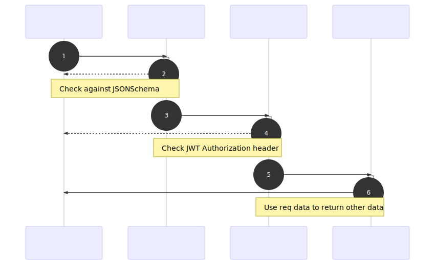

<!-- markdownlint-disable first-line-h1 line-length -->

[](https://badge.fury.io/js/%40asd14%2Fblocks)
[](https://coveralls.io/github/asd14/blocks)

# blocks

> `request` |> `think hard` |> `response`



---

<!-- vim-markdown-toc GFM -->

* [Features](#features)
  * [Validate input](#validate-input)
  * [Permissions](#permissions)
  * [Async/await](#asyncawait)
  * [Other](#other)
* [Install](#install)
* [Example](#example)
* [Routes](#routes)
  * [Default "/ping" route](#default-ping-route)
  * [Add route](#add-route)
* [Plugins](#plugins)
  * [Default "Config" plugin](#default-config-plugin)
  * [Add plugin](#add-plugin)
* [Develop](#develop)
* [Changelog](#changelog)
  * [0.7 - 11 July 2019](#07---11-july-2019)
    * [Change](#change)

<!-- vim-markdown-toc -->

## Features

### Validate input

> Pass request data (headers, body, query parameters, URL parameters) through custom JSON Schemas defined for each route. Make sure no unwanted data gets in, de-clutter the route logic and make the API behave more consistent.  
If validation fails, an automatic `409 Conflict` response will be sent to the client.

See [`ajv`](https://github.com/epoberezkin/ajv) and [JSON Schema docs](https://json-schema.org) for more on data validation.

### Permissions

> Simple function outside of main route logic.  
If it returns false, an automatic `403 Forbidden` response will be sent to the client.

### Async/await

> Route actions, middleware and plugins can return a promise.

### Other

* Query string parsing - [`qs`](https://github.com/ljharb/qs)
* Cross-origin resource sharing - [`cors`](https://github.com/expressjs/cors)

## Install

```bash
npm i @asd14/blocks
```

## Example

`src/index.js`

```js
const http = require("http")
const glob = require("glob")
const { block } = require("@asd14/blocks")

block({
  settings: {
    // Used by default /ping route
    NAME: pkg.name,
    VERSION: pkg.version,

    // Not used yet
    ENV: "development",

    // Passed to "cors" 3rd party middleware
    CORS_ORIGIN: null,
    CORS_METHODS: ["GET", "POST", "PUT", "PATCH", "DELETE", "OPTIONS"],

    // Other
    PORT: 8080,
  },

  // string[]  Plugins and routes absolute file paths.
  //           Using `glob` for easy scanning.
  plugins: glob.sync("./src/plugins/*.js", { absolute: true }),
  routes: glob.sync("./src/**/*.route.js", { absolute: true }),

  middleware: {
    beforeRoute = [],
    afterRoute = [],
    afterError = [],
    beforeSend = [],
  },
}).then(({ Plugins: { Config }, middlewarePipeline }) =>
  http
    .createServer(middlewarePipeline)
    .listen(Config.get("PORT"), "localhost", () => {
      console.log(`### Started server on port ${Config.get("PORT")}`)
    })
)
```

## Routes

### Default "/ping" route

`GET: /ping`

```js
{
  "ping": "pong",
  "aliveFor": {
    "days": 2, "hours": 1, "minutes": 47, "seconds": 46
  },
  "name": "foo",
  "version": "0.5.6",
}
```

### Add route

`src/something.route.js`

```js
module.exports = {
  method: "GET",
  path: "/something",

  // If req data is valid
  // -> continue to permissionn check
  // -> otherwise return 409
  schema: require("./something.schema"),

  // If allowed
  // -> continue to action
  // -> otherwise return 403
  isAllowed: (/* pluginsObj */) => async ({ method, ctx }) => {
    console.log(`${method}:${ctx.pathname} - isAllowed`)

    return true
  },

  // Returned value will be set in `res` body
  action: (/* pluginsObj */) => async (/* req */) => {
    return {
      message: "This is something else!"
    }
  },
}
```

`src/something.schema.js`

```js
module.exports = {
  type: "object",
  properties: {
    headers: {
      type: "object",
    },

    params: {
      type: "object",
      additionalProperties: false,
    },

    query: {
      type: "object",
      additionalProperties: false,
    },

    body: {
      type: "object",
      additionalProperties: false,
    },
  },
}
```

## Plugins

Separate code interfacing 3rd party libraries or services. Plugins are accesible in middleware and routes ([pluginus](https://github.com/asd14/pluginus) dependency injection library is used under the hood).

### Default "Config" plugin

Getter over the settings object when instantiating `blocks`.

While you can use `process.env` to access CI variables globally, use this opportunity to write a few words about each.

`src/index.js`

```js
blocks({
  settings: {
    // (CI) Key to verify incoming json-web-tokens. See `src/middleware/req-jwt.js`
    JWT_SECRET: process.env.JWT_SECRET ?? "CHANGE ME!"
    ...
  },
  ...
})
```

`src/middleware/req-jwt.js`

```js
module.exports = ({ Config }) => (req, res, next) => {
  ...
  jwt.verify(req.headers.authorization, Config.get("JWT_SECRET"))
  ...
}
```

### Add plugin

A plugin consists of a constructor function and a list of other plugins that is dependent on.

Whatever the `create` function returns will be considered as the plugin's content and is what will be exposed to the routes, middleware and other plugins.

`src/plugins/database.js`

```js
const Sequelize = require("sequelize")

module.exports = {
  /**
   * Array of plugins to wait for before running `create`.
   * Name is constructed from the filename by removing the extension and
   * turning it into CammelCase.
   *
   * Ex. "test__name--BEM.plugin.js" => "TestNameBemPlugin"
   */
  depend: ["Config"],

  /**
   * Constructor, return value will be considered the plugin's content exposed
   * to routes, middleware and other plugins.
   *
   * @param  {Object}  props  Initial settings object passed to the `blocks`
   *                          constructor
   *
   * @returns  {any|Promise<any>}  Plugin content
   */
  create: (/* props */) => Config => {
    console.log("Checking DB connection")

    // Database connection, model loading etc
    ...
    return {
      Todos: ...,
      Comments: ...,
    }
  }
}
```

## Develop

```bash
git clone git@github.com:asd14/blocks.git && \
  cd blocks && \
  npm run setup
```

Run all `*.test.js` in `examples` folder

```bash
npm test
```

Watch `src` and `examples` folders and re-run tests

```bash
npm run tdd
```

## Changelog

History of all changes in [CHANGELOG.md](/CHANGELOG.md)

### 0.7 - 11 July 2019

#### Change

* Update packages
